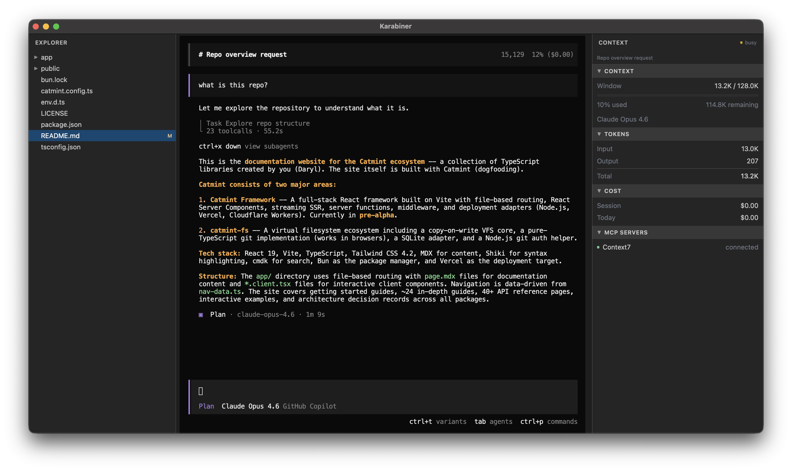

# Karabiner

A lightweight desktop code editor built with [Electrobun](https://electrobun.dev), React, and TypeScript. Karabiner provides a VSCode-inspired interface with integrated terminal, Monaco editor, git support, and a dockable panel layout — all in a ~14MB bundle with sub-50ms startup.



## Features

- **Monaco Editor** — Full-featured code editing with syntax highlighting for 30+ languages, minimap, bracket matching, and save-to-disk
- **Integrated Terminal** — PTY-backed terminal with xterm.js, WebGL rendering, truecolor support, search, and Cmd+click URL opening
- **Git Integration** — Branch display, ahead/behind tracking, file status decorations (modified, added, deleted, untracked, renamed, conflicted) propagated through the file tree
- **Diff Viewer** — Side-by-side diff view for git-modified files
- **File Explorer** — Recursive directory tree with git status decorations and smart directory filtering
- **Command Palette** — Quick access to commands via `Cmd+K` or `Cmd+Shift+P`
- **Dockable Panels** — Flexible tabbed layout powered by Dockview, supporting splits and rearrangement
- **Image Preview** — In-editor preview for common image formats
- **Theming** — Dark and light themes with system preference detection

## Getting Started

**Prerequisites:** [Bun](https://bun.sh) and the [Electrobun CLI](https://electrobun.dev)

```bash
# Install dependencies
bun install

# Development with HMR (recommended)
bun run dev:hmr

# Development without HMR (watches for changes, rebuilds automatically)
bun run dev

# Build and run with bundled assets
bun start

# Build for distribution (canary)
bun run build:canary
```

### How HMR Works

When you run `bun run dev:hmr`:

1. A Vite dev server starts on `http://localhost:5173`
2. Electrobun detects the running Vite server and loads from it
3. Changes to React components update instantly without a full reload

## Project Structure

```
src/
├── bun/
│   └── index.ts              # Main process: window, PTY, file I/O, git, menus, watchers
├── mainview/
│   ├── App.tsx               # Root component: layout, workspace state, panel orchestration
│   ├── main.tsx              # React entry point
│   ├── index.html            # HTML template
│   ├── index.css             # Tailwind v4 theme tokens, Dockview/xterm/cmdk styles
│   ├── rpc.ts                # Webview-side RPC bridge
│   └── components/
│       ├── TerminalPanel.tsx  # xterm.js terminal with PTY and search
│       ├── EditorPanel.tsx    # Monaco editor with save and language detection
│       ├── DiffPanel.tsx      # Git diff viewer
│       ├── Sidebar.tsx        # File tree with git status decorations
│       ├── StatusBar.tsx      # Bottom bar: branch, changes, encoding
│       ├── CommandPalette.tsx # Cmd+K command palette
│       └── ContextPanel.tsx   # Right-side collapsible info panel
└── shared/
    └── rpc.ts                # Shared RPC type definitions (Bun <-> Webview)
```

## Tech Stack

- **[Electrobun](https://electrobun.dev)** — Desktop framework using Bun + system WebView
- **[React 19](https://react.dev)** + **TypeScript**
- **[Tailwind CSS v4](https://tailwindcss.com)** + PostCSS
- **[Vite 6](https://vite.dev)** — Build tooling and dev server
- **[Monaco Editor](https://microsoft.github.io/monaco-editor/)** — Code editing
- **[xterm.js](https://xtermjs.org)** — Terminal emulation
- **[Dockview](https://dockview.dev)** — Panel layout system
- **[cmdk](https://cmdk.paco.me)** — Command palette

## License

[AGPL-3.0](LICENSE)
