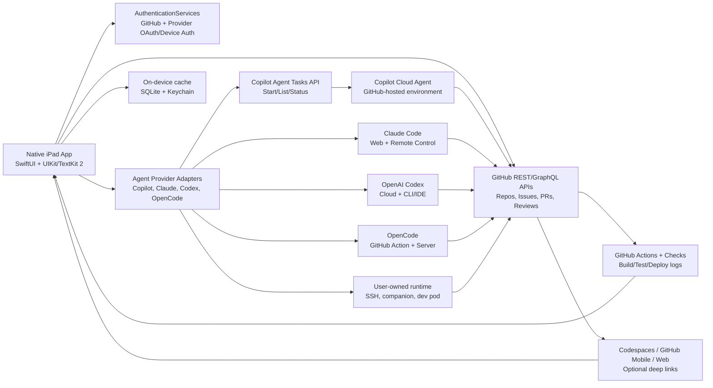

# Product Requirements Document: iPad Agentic IDE

Last updated: 2026-05-22

## 1. Executive summary

Build a native iPadOS IDE for agentic software development. The app lets a user authenticate with GitHub and optional agent providers, connect repositories, use existing AI subscriptions where officially supported, and build complete apps/projects from an iPad with a touch, Pencil, trackpad, and hardware-keyboard-first workflow.

The product should not try to turn iPadOS into macOS. iPadOS is the best surface for a polished, secure, responsive development cockpit, but it is not the right place to run arbitrary build systems, package managers, shells, compilers, or agent tool loops. V1 should pair a high-quality native Swift iPad client with provider-hosted and user-owned execution: GitHub-hosted execution first, plus Claude Code, OpenAI Codex, OpenCode, Codespaces, and local/remote dev runtimes where users authenticate with their own accounts.

**Recommended stack:** Swift 6 + SwiftUI for the iPad app shell; UIKit/TextKit 2/Tree-sitter for the editor; AuthenticationServices and Keychain for OAuth/device-code auth; FileProvider for Files integration; GitHub REST/GraphQL APIs; Copilot cloud agent Agent Tasks REST API; Claude Code web/remote-control integration; Codex cloud/CLI/IDE integration; OpenCode GitHub Action and remote server integration; GitHub Actions/Checks/PRs for validation and review. Defer a dedicated backend and custom workspace runtime until provider APIs, deep links, or user-owned runtimes cannot support a required V1 workflow.

**Core product bet:** competitors are strong at either desktop AI IDE workflows, web/cloud app generation, or mobile remote-control views. The opportunity is a complete iPad-native agentic IDE: full repo context, deep GitHub/Copilot integration, optional Claude/Codex/OpenCode provider support, native review/edit UX, secure cloud/user-owned execution, multi-agent orchestration, and mobile-first product polish.

## 2. Research highlights and conclusions

### 2.1 Platform and stack conclusions

| Question | Decision | Rationale |
| --- | --- | --- |
| Swift, SwiftUI, UIKit, or AppKit? | Use **Swift + SwiftUI + UIKit**. Do not use AppKit for iPadOS. | SwiftUI is Apple's declarative UI framework across platforms, and UIKit remains the advanced iPadOS framework for text, input, menus, keyboard, document, and event handling. AppKit is macOS-only; Catalyst can be evaluated later for a Mac companion. |
| Can V1 run builds, shells, package managers, and AI tools on-device? | No. Use **GitHub-hosted remote execution first**. | App Store Guideline 2.5.2 restricts downloading/installing/executing code that changes app functionality. iPadOS app sandboxing and process restrictions also make arbitrary terminal/build execution unsuitable. |
| How should GitHub auth work? | Use **user-to-server GitHub authentication** through AuthenticationServices. | The Copilot Agent Tasks API currently supports user-to-server tokens: PATs, OAuth app tokens, or GitHub App user-to-server tokens. It does not support server-to-server installation tokens. |
| How should Copilot subscription access work? | Use **Copilot cloud agent Agent Tasks REST API first**. | The API can start/list/check Copilot cloud agent tasks programmatically. It is currently public preview for Copilot Business/Enterprise organizations; GitHub says Pro/Pro+ and GitHub App installation token support are coming soon. Use a Copilot SDK backend only if we need a custom real-time agent runtime or if required plans are not supported by the cloud-agent API. |
| Should V1 support Claude, Codex, and OpenCode? | Yes. Add a **provider adapter layer**. | GitHub/Copilot remains default, but users should be able to connect Claude Code on the web/Remote Control, Codex cloud/CLI/IDE, and OpenCode GitHub Action or remote server flows using their own subscriptions or API keys where officially supported. |
| Can users do local dev? | Yes, through **user-owned compute**, not arbitrary iPad execution. | Support local files/cache on iPad, plus SSH/Codespaces/user Mac/Linux/Windows companion runtimes, Claude Remote Control, Codex CLI auth, and OpenCode `web`/`serve`/`attach` flows. Treat an in-app VM as out of scope unless Apple provides an App Store-safe virtualization entitlement path. |
| How should code editing work? | Start with **Runestone + Tree-sitter**, backed by GitHub file/diff/PR APIs. | Runestone is an iOS/iPadOS code editor with syntax highlighting, line numbers, search, indentation, wrapping, and Tree-sitter parsing. Full LSP should be treated as a later Codespaces/custom-backend capability unless GitHub exposes a supported native API surface. |
| Should local Git exist? | Yes, but as a limited/offline convenience. | Use libgit2/SwiftGit2 for local diff/status/commit operations where feasible; use GitHub branches, commits, PRs, Checks, and Actions as the primary source of truth. |

### 2.2 Competitor summary

| Competitor | Strengths | Weaknesses/opportunity for us |
| --- | --- | --- |
| **GitHub Copilot cloud agent / GitHub Mobile** | Deep GitHub integration, issue/PR workflows, background agents, mobile session visibility, existing Copilot subscription support, and a public-preview Agent Tasks REST API for Business/Enterprise organizations. | GitHub Mobile is primarily a control/review surface, and the API is task/status oriented rather than a full terminal/editor/LSP/preview API. This is still the best V1 foundation if we design around GitHub-native workflows. |
| **GitHub Copilot SDK** | Official agentic runtime behind Copilot CLI; handles planning, tool calls, file edits, streaming, MCP, custom tools, auth, and model management. | Public preview and not Swift-native. Treat as a fallback/future path for custom runtime features that GitHub cloud agent does not expose. |
| **Claude Code** | Official terminal, IDE, desktop, web, and mobile surfaces. Claude Code on the web runs tasks on Anthropic-managed cloud infrastructure; Remote Control lets users control a local Claude Code session from web/mobile while computation stays on their machine. | Provider-specific. Cloud sessions have Anthropic resource and secrets limitations; Remote Control requires the local process to stay running. We can wrap both as provider adapters instead of reimplementing Claude's runtime. |
| **OpenAI Codex** | Codex cloud runs tasks in OpenAI-managed cloud environments, connects to GitHub, creates PRs, supports ChatGPT subscription auth, API-key auth for CLI/IDE, IDE cloud delegation, and `@codex` GitHub workflows. | Less iPad-native. Cloud task management is provider-specific, and API-key use follows platform billing rather than ChatGPT subscription entitlements. We should support Codex as a first-class provider without depending on it as the only runtime. |
| **OpenCode** | Open source coding agent with terminal, desktop, IDE, web/server modes, GitHub Action integration, GitHub App workflow, remote server attach, 75+ providers, local models, and official GitHub Copilot subscription support. | Best for power users and self-hosted/local runtimes. Provider subscription support varies; Claude Pro/Max via OpenCode should not be offered because Anthropic prohibits that path. Use official Claude surfaces for Claude subscription users. |
| **Cursor** | AI-native desktop IDE, agent mode, rules, MCP, codebase context, multi-file edits, CLI. | Desktop-first. Not an iPad-native development environment; assumes local/desktop runtime and keyboard/mouse workflows. |
| **Windsurf Cascade** | Strong flow awareness, web tools, deployment, organization features, and agentic editing in a VS Code-like environment. | Desktop-first. Less focused on GitHub/Copilot subscription leverage and iPad-native review/edit ergonomics. |
| **Replit Agent** | Excellent natural-language app generation, live deployment, built-in database/auth, browser testing, low-code accessibility, mobile-friendly product. | Replit-hosting-centric, less repo/pro-dev/GitHub-native, less suited for complex team-controlled architectures and enterprise review flows. |
| **CodeSandbox / StackBlitz-style web IDEs** | Fast web previews, cloud sandboxes, frontend prototyping. | Browser/web-app centric, weaker native iPad UX, limited deep backend/mobile/native workflows. |
| **Existing iPad developer tools: Working Copy, Textastic, Runestone, Blink/a-Shell** | Strong point solutions for Git, code editing, SSH/shell, or text editing. | Fragmented workflow. No integrated Copilot-backed agentic IDE with GitHub-hosted agents, PR automation, and native diff/review/preview loop. |

### 2.3 Differentiated product wedge

The winning V1 should feel like "Cursor + Copilot cloud agent + Working Copy + TestFlight-quality iPad app" rather than a web IDE in a wrapper.

Primary differentiators:

1. **Native iPad workflow:** Split views, stage manager, hardware keyboard shortcuts, Pencil annotations, drag/drop, Files integration, offline drafts, responsive editor.
2. **Subscription leverage:** GitHub Copilot, ChatGPT/Codex, Claude, OpenCode, GitLab Duo, and provider API keys should be usable where official auth paths permit.
3. **Provider-hosted execution with native control:** Copilot cloud agent, Claude Code web/Remote Control, Codex cloud, OpenCode GitHub Actions/remote server, Issues, Pull Requests, Actions, Checks, Codespaces, and user-owned runners provide execution while the iPad app provides the native cockpit.
4. **Review-first agent UX:** Every agent action is inspectable, reversible, diffable, and permissioned. The app turns opaque AI output into a reviewable engineering workflow.
5. **Multi-agent orchestration across providers:** Start, pause, compare, steer, and merge parallel agents from GitHub, Claude, Codex, OpenCode, and local/user-owned runtimes from the iPad.
6. **Production app building:** Not just prototypes. V1 includes repo rules, secrets, CI, deployment previews, database/auth scaffolds, app-store-grade auditability, and handoff to PRs.

## 3. Product vision

### 3.1 Product statement

An iPad-native agentic IDE for developers who want to create, inspect, steer, and ship software with GitHub Copilot from anywhere without losing the rigor of professional engineering workflows.

### 3.2 Target users

| Persona | Needs |
| --- | --- |
| Solo builder with Copilot Pro/Pro+ | Create apps from natural language, inspect generated code, run previews, deploy, and submit PRs from iPad. |
| Professional developer | Review and steer background work, fix issues, run tests, edit code, and merge PRs without a laptop. |
| Engineering lead | Assign parallel agents, compare approaches, enforce repo guidelines, audit agent actions, and manage quality gates. |
| Designer/product engineer | Use Pencil/touch to annotate UI, generate changes, preview screens, and ship product iterations. |
| Enterprise admin | Control repository access, agent permissions, secrets, data retention, observability, and compliance. |

### 3.3 V1 principles

1. **Native first, web where it wins:** Use Swift/iPadOS for UI and remote web previews only for user projects.
2. **Remote/user-owned execution by design:** Run arbitrary code through provider-hosted agents, GitHub-hosted agent environments, Actions, Codespaces, SSH-connected machines, or external deploy providers, never as host-app functionality on iPad.
3. **Everything reviewable:** Plans, tool calls, file reads, diffs, commands, tests, previews, and PRs are visible.
4. **Human permission gates:** Destructive commands, secret access, external network access, deploys, billing-impacting model use, and PR merges require explicit user approval.
5. **GitHub-native, provider-optional:** GitHub auth, Issues, PRs, Checks, Actions, Copilot cloud agent, Copilot remote sessions, and GitHub Mobile interoperability are first-class, with Claude/Codex/OpenCode adapters as user-selectable alternatives.
6. **Large-team ready:** Audits, RBAC, policy, observability, workspace isolation, metrics, and supportability are V1 requirements.
7. **Touch and keyboard parity:** Every important workflow works with touch/Pencil and has keyboard shortcuts.
8. **No black boxes:** Agent output must be explainable, diffable, replayable, and recoverable.

## 4. Recommended technical stack

### 4.1 iPad client

| Layer | Recommendation | Notes |
| --- | --- | --- |
| Language | Swift 6 | Use strict concurrency, async/await, Observation, and structured error handling. |
| UI shell | SwiftUI | NavigationSplitView, inspector panels, toolbars, sheets, search, commands, adaptive layouts. |
| Pro/editor UI | UIKit + TextKit 2 | Use UIKit where SwiftUI is not mature enough for source editing, keyboard handling, custom selection, scroll synchronization, and performance. |
| Code editor | Runestone/Tree-sitter initially; fork or custom editor if needed | Runestone is iOS-focused and Tree-sitter-backed. V1 should budget for a fork to add collaboration, diagnostics, inline diffs, and optional source-intelligence decoration. |
| Auth | AuthenticationServices + GitHub OAuth with PKCE | Use ASWebAuthenticationSession/WebAuthenticationSession for GitHub web auth. Store tokens in Keychain. |
| Secrets | Keychain + Secure Enclave where useful | Never persist raw Copilot/GitHub tokens outside Keychain. |
| Local cache | SQLite with GRDB; SwiftData only for simple app metadata | IDE caches, file indexes, transcript search, and diffs need explicit migrations and query control. |
| Files integration | FileProvider + document browser/local document sharing | FileProvider for synced workspace documents; local document keys for user-visible files. |
| Networking | URLSession first; WebSocket/SSE only for GitHub-supported streams or a future thin relay | GitHub task status, PRs, Checks, Actions logs, and repository data are fetched through GitHub APIs. |
| Diff rendering | Native Swift renderer with syntax-aware hunks | Needs inline comments, staged review, accepted/rejected hunks, and keyboard navigation. |
| Accessibility | VoiceOver, Dynamic Type where feasible, hardware keyboard navigation | Code editor needs custom accessibility strategy for line/column, diagnostics, and diff hunks. |

### 4.2 GitHub-native execution and integration

| Layer | Recommendation | Notes |
| --- | --- | --- |
| Agent execution | GitHub Copilot cloud agent Agent Tasks REST API | Start, list, and inspect cloud-agent tasks without owning an agent backend. Current public preview is Business/Enterprise organizations only; Pro/Pro+ API support is announced as coming soon. |
| Agent entry points | Issues, PR comments, Agents tab/deep links, Agent Tasks API | Use GitHub-native primitives so output lands in branches, commits, and PRs with transparent logs. |
| Repository data | GitHub REST and GraphQL APIs | Branches, files, commits, issues, PRs, reviews, checks, statuses, discussions, and repository metadata are the product state. |
| Build/test validation | GitHub Actions and Checks | Prefer existing repository CI over custom runners. The app should summarize and deep link to logs/check runs. |
| Live coding/runtime | GitHub Codespaces where available; otherwise defer | Use Codespaces/deep links for terminals, ports, and development environments if supported. Do not build a custom workspace backend for V1 unless this becomes a hard requirement. |
| Local state | On-device SQLite/GRDB + Keychain | Cache repositories, editor drafts, task IDs, PR state, preferences, and transcript summaries locally. GitHub remains source of truth. |
| Notifications | Foreground polling first; optional thin notification relay later | Without a backend, rich APNs/webhook notifications are limited. A small relay can be added without becoming an agent/workspace backend. |
| Policy | GitHub permissions, branch protection, Actions policies, Copilot policies | Use GitHub's own controls first. Add custom policy only if enterprise requirements cannot be expressed in GitHub. |
| Observability | GitHub task status, PR timelines, Checks, Actions logs, local client diagnostics | Avoid duplicating GitHub's audit trail. If a thin backend is added, it should store only minimal product telemetry. |

### 4.3 Agent provider adapter layer

V1 should expose providers through a normalized `AgentProvider` abstraction while preserving provider-specific capabilities and limits. The app should not scrape credentials or pretend every provider has identical semantics. Each adapter must declare auth type, task lifecycle support, repository access path, streaming/log capabilities, execution environment, budget visibility, and PR/write permissions.

| Provider/runtime | Official auth path | iPad integration | Best use | Key limitations |
| --- | --- | --- | --- | --- |
| GitHub Copilot cloud agent | GitHub OAuth/user-to-server token; Agent Tasks API where available | Native API integration for task start/list/status; Issues, PRs, Checks, Actions, and deep links | Default V1 execution path for GitHub repos and Copilot subscribers | Public-preview API currently limited to Copilot Business/Enterprise orgs; raw terminal/LSP/preview surfaces are limited |
| Claude Code on the web | Claude account/subscription and GitHub App or web setup | Deep link plus task/session metadata where APIs allow; GitHub PR/branch sync | Anthropic-managed background coding sessions and cloud PR work | Provider-managed cloud resource/network limits; full programmatic task APIs may be limited |
| Claude Code Remote Control | Claude Code authenticated locally with Pro/Max/Team/Enterprise or supported provider | User connects app to a running local Claude Remote Control session or opens provider mobile/web surface | Use a user's full local machine, tools, MCP servers, files, and subscriptions without our backend | Local machine must stay awake/online; the app should not proxy raw credentials |
| OpenAI Codex cloud | ChatGPT account with Codex plan and GitHub connection | Deep link/provider API integration; GitHub branch/PR synchronization | Parallel cloud tasks, PR creation, and background fixes | Provider-specific cloud lifecycle; subscription entitlements differ from API-key billing |
| OpenAI Codex CLI/IDE | ChatGPT sign-in or OpenAI API key on user-owned machine | Remote-control or SSH into a trusted local/VM runtime running Codex | Local tools plus ChatGPT subscription access where supported | Requires user-owned compute and local process supervision |
| OpenCode GitHub Action | GitHub App/workflow plus provider credentials in GitHub secrets | `/opencode` or `/oc` issue/PR command workflow surfaced natively | Open source agent execution inside GitHub Actions runners | Depends on workflow setup, runner minutes, and provider secrets |
| OpenCode server/web | OpenCode `serve`, `web`, or TUI-attached server on user-owned compute | Connect by HTTPS/LAN/VPN/Tailscale with server password and explicit trust | Power-user local/self-hosted agent runtime with many providers and local models | Must be secured by user; Claude Pro/Max via OpenCode should not be offered because Anthropic prohibits that path |
| Codespaces | GitHub auth and repository/devcontainer access | Deep links or embedded web surfaces where allowed | Live terminal, forwarded ports, devcontainers, and rich cloud dev environment | GitHub-hosted UX may remain web-based; API coverage for native terminal/LSP can be limited |
| SSH/local dev pod | SSH key, local companion, or user-managed HTTPS tunnel | Native runtime registry, health check, terminal/log bridge, file sync policy | Super-light user-owned VM/container on Mac, Linux, Windows, NAS, or cloud VM | Highest security burden; must be opt-in and clearly outside iPad sandbox |

Provider adapters should share a common task envelope:

1. `Draft`: user prompt, context bundle, target repo/branch, provider, runtime, model, budget, and policy.
2. `Started`: provider task/session ID, branch/worktree, links, permissions, and expected outputs.
3. `Running`: status, transcript/log deltas, changed files, checks, approvals, cost/request estimates, and provider-specific links.
4. `Reviewable`: diff, commits, PR, artifacts, preview links, and test summary.
5. `Closed`: merged, abandoned, failed, archived, or exported.

### 4.4 Local and user-owned dev runtime strategy

"Local dev" should mean user-owned execution rather than executing arbitrary project code in the iPad app. V1 should support four runtime levels:

| Runtime level | Description | V1 posture |
| --- | --- | --- |
| On-device iPad workspace | Local cache, drafts, file browsing, diff review, prompt prep, Git metadata, and limited libgit2 operations. | Required. Never run arbitrary package managers, build systems, or generated app code inside the app. |
| Provider cloud runtime | Copilot cloud agent, Claude Code on the web, Codex cloud, GitHub Actions, and hosted deployment previews. | Required. This is the safest default for iPad and App Store review. |
| User-owned remote runtime | User Mac/PC/Linux box, NAS, desktop companion, or cloud VM running Claude Code, Codex CLI, OpenCode server, SSH, or devcontainer. | Required as an advanced V1 mode because it unlocks existing subscriptions and local tools without our backend. |
| In-app VM/runtime | Virtual machine or sandboxed interpreter shipped inside the iPad app. | Out of scope for App Store V1 unless Apple provides a clear entitlement/review path. |

The user-owned runtime should be "super light" by default: a documented bootstrap script or packaged companion that installs no global secrets into our service, exposes a small authenticated control endpoint or SSH target, and lets the user choose installed agents. The app should provide runtime health checks, trust prompts, log redaction, and one-tap disconnect.

### 4.5 Architecture overview

### 4.6 Do we need a dedicated backend?

AppKit is not an iPadOS framework. The iPad app should use SwiftUI and UIKit. Mac support should be a later Catalyst/macOS target only if the iPad product proves the workflow.

The updated recommendation is **no dedicated agent/workspace backend for V1**. GitHub's Copilot cloud agent, Agent Tasks REST API, Issues, Pull Requests, Actions, Checks, Codespaces/deep links, provider-hosted agents, and user-owned runtimes should be the execution layer wherever possible.

A backend should be introduced only for explicit gaps:

1. Rich APNs notifications from GitHub/provider webhooks.
2. Custom cross-repo scheduling/fleet orchestration beyond what the Agent Tasks API supports.
3. Live terminal, LSP, debug adapter, or preview proxy features that Codespaces/provider APIs and user-owned runtimes do not expose.
4. Custom Copilot SDK runtime behavior, hosted BYOK provider execution, non-GitHub repositories, or managed dev pods.
5. Enterprise policy/audit features that cannot be satisfied by GitHub org, branch protection, Actions, Copilot controls, provider controls, and local audit logs.

If needed, start with a **thin backend** for webhooks, notification fanout, encrypted preference sync, and provider event normalization. Do not build Kubernetes/Firecracker workspaces, Temporal orchestration, or a Copilot SDK agent service until GitHub-native/provider-native/user-owned workflows prove insufficient.

### 4.7 App Store and platform compliance posture

V1 must be explicit that the iPad app is an IDE/control plane and that user code executes through provider-hosted services, GitHub-hosted services, user-owned machines, or external remote services, not as downloaded host-app functionality. The app should:

1. Keep all host-app features self-contained in the reviewed app bundle.
2. Make user project source fully visible and editable.
3. Run generated apps/builds/tests through Copilot cloud agent, Claude/Codex/OpenCode providers, GitHub Actions, Codespaces, user-owned runtimes, or external browser contexts.
4. Include App Review notes explaining remote execution, developer-tool purpose, source visibility, and user-controlled repositories.
5. Avoid shipping hidden interpreters that alter app behavior.
6. Provide a Safari handoff fallback for arbitrary generated app previews if embedded previews create review risk.

## 5. V1 product scope

The V1 target is intentionally complete. No core product capability is deferred if it is required for a stable, professional agentic IDE.

### 5.1 Onboarding and authentication

Requirements:

1. User can sign in with GitHub using a secure native web authentication session.
2. User can connect a GitHub App installation to one or more repositories or organizations.
3. App clearly explains required permissions: identity, repository read/write, issues, pull requests, checks, webhooks, and Copilot-related access.
4. User can verify Copilot plan availability and request/quota status where APIs permit.
5. User can optionally connect Claude, Codex/OpenAI, OpenCode, Codespaces, SSH, and local companion runtimes through official OAuth, device-code, provider web, or local trust flows.
6. User can choose a default organization, repository, branch, workspace template, agent provider, and runtime.
7. User can revoke sessions, delete local data, disconnect GitHub, disconnect providers, and forget local runtimes.
8. Enterprise users can use SSO/SAML flows supported by GitHub and connected providers.
9. Tokens are stored only in Keychain on-device unless a thin backend is later introduced for webhook/notification relay; no client secret is embedded in the app bundle.

Acceptance criteria:

- OAuth uses PKCE and validates state.
- The app never exposes client secrets in the iPad bundle.
- A repository cannot be accessed unless the authenticated GitHub user token has the required repository permissions.
- Auth failures are actionable and distinguish expired session, SSO required, missing Copilot/provider access, missing repo permission, local runtime offline, and organization policy block.

### 5.2 Home, workspace, and repository management

Requirements:

1. Home shows recent repositories, active agent sessions, pending approvals, failing checks, assigned issues, and draft PRs.
2. User can create a new project from templates or natural language.
3. User can open GitHub repositories, create Copilot cloud agent tasks, and optionally cache selected files locally.
4. User can create, rename, pause, archive, resume, and delete workspaces.
5. User can pin multiple workspaces in Stage Manager-friendly tabs/windows.
6. Workspace state survives app termination, iPad sleep, and network loss by restoring from local cache plus GitHub task/PR/check state.
7. User can search across repositories, files, symbols, agent transcripts, and PRs.
8. Workspaces show branch, changed files, active provider tasks, PRs, Checks, Actions runs, Codespaces/local-runtime/deployment links, and CI state.

Acceptance criteria:

- Workspace open/resume restores editor tabs, provider task IDs, relevant PRs, Actions logs, pending reviews, runtime links, and preview/deployment links.
- Repository browsing remains usable for large repositories through GitHub APIs, lazy file loading, local cache, and optional GitHub search/code search.
- All workspace actions emit audit events.

### 5.3 Agentic chat and planning

Requirements:

1. User can ask questions about a repository with file, symbol, issue, PR, and web context.
2. User can request plans without code changes.
3. User can approve a plan and let an agent implement.
4. User can choose agent mode: research, plan, implement, review, debug, test, refactor, document, scaffold, deploy.
5. User can select provider, runtime, and available models when the provider exposes model selection.
6. Agent can research, plan, edit files, run validation in provider-hosted or user-owned environments, and open PRs through the selected provider.
7. App shows task state, PR timeline, commits, Checks, Actions logs, runtime health, and session links; raw tool-call streaming is supported only where the provider exposes it.
8. User can start, list, inspect, retry, and steer agents through supported provider APIs, issue assignment, PR comments, remote-control sessions, SSH/local runtime commands, and deep links.
9. User can compare two or more agent attempts side-by-side before accepting changes.
10. Agents respect repo rules, custom instructions, policy, and user approvals.

Acceptance criteria:

- Destructive repository operations still require explicit user action through GitHub branch/PR controls.
- Agent cannot access repository secrets unless GitHub/Copilot policy grants access.
- Every file change is tied to GitHub commits, PRs, checks, and available provider task metadata.
- Failed or stopped sessions preserve provider task status, PR branches, logs, runtime state, and diffs.

### 5.4 Multi-agent orchestration

Requirements:

1. User can launch multiple agents against one issue or prompt.
2. User can assign agents to different subtasks and dependencies.
3. User can view a fleet board: provider, runtime, status, branch, diff size, tests, blockers, cost/request usage, and confidence.
4. User can merge agent outputs manually through diff review.
5. User can designate specialist agents: frontend, backend-services, tests, security, docs, migration, performance.
6. User can set per-agent budgets where providers expose usage/request data; otherwise the app warns based on task count and plan-level limits.
7. User can save reusable agent recipes for common project types.

Acceptance criteria:

- Parallel agents run in isolated GitHub branches/tasks or isolated local worktrees by default.
- The app prevents silent overwrites and highlights conflicting changes.
- Fleet runs are resumable and auditable.

### 5.5 Native code editor

Requirements:

1. Syntax highlighting for common languages using Tree-sitter.
2. Line numbers, minimap/outline, search/replace, regex search, indentation detection, tab/space settings, wrapping, invisible characters.
3. Fast local typing with remote sync.
4. Multi-tab editor with split panes.
5. Inline diagnostics from GitHub Checks, Actions annotations, static analysis outputs, and optional Codespaces/LSP integration if available.
6. Definitions, references, symbols, hover docs, rename, and code actions are best-effort V1 features using local parsing, GitHub APIs, and future Codespaces/LSP integration rather than a custom backend.
7. Inline agent suggestions and generated patches.
8. Diff overlay: additions, deletions, conflicts, comments, blame, and agent provenance.
9. Hardware keyboard shortcuts for editor, navigation, search, Git, agent actions, review, logs, and optional Codespaces terminal/deep links.
10. Touch/Pencil gestures for selection, annotation, quick actions, and screenshot-to-prompt.
11. Offline draft editing for cached files, with conflict resolution on reconnect.

Acceptance criteria:

- Typing latency remains native-feeling for normal source files.
- Opening very large files degrades gracefully with read-only/streaming mode.
- Remote diagnostic/source-intelligence failures do not block local editing.
- Conflicts are never auto-resolved without user visibility.

### 5.6 File tree, search, and project intelligence

Requirements:

1. File tree with Git status, ignored files, generated files, and agent-changed files.
2. Global text search, symbol search, natural-language code search, and command palette.
3. Index status visible per repository/workspace.
4. User can include/exclude folders from agent context and search.
5. User can pin context bundles: files, folders, issues, docs, web pages, Actions logs, provider task logs, and test failures.
6. App maintains project maps: frameworks, package managers, entry points, build commands, test commands, deployment targets.

Acceptance criteria:

- Search results distinguish local cache, GitHub repository results, PR results, and generated branch results.
- Agent context selections are visible before execution.
- Indexes are invalidated on branch changes and file updates.

### 5.7 Git and source control

Requirements:

1. Clone, branch, checkout, fetch, pull, merge, rebase, cherry-pick, tag, stash, commit, push.
2. Diff and stage individual hunks/files.
3. Conflict resolution UI with base/current/incoming/result panes.
4. Commit authoring with AI-generated suggestions and user edit.
5. PR creation and update from app.
6. PR review with inline comments, pending review drafts, checks, requested changes, approvals, merge queue support where available.
7. GitHub issue linkage, labels, milestones, assignees, and project fields.
8. Support Git LFS, submodules, private packages, and deploy keys through provider-hosted environments, GitHub-hosted agent environments, Actions, Codespaces, or user-owned runtimes where supported.
9. Local/offline Git status/diff for cached workspaces using libgit2 where feasible.

Acceptance criteria:

- No push/force-push/merge without explicit user confirmation.
- Git operations show exact command/log and resulting branch state.
- App can recover from interrupted Git operations by refetching GitHub branch/commit/PR state and preserving local drafts.

### 5.8 Remote command execution and logs

Requirements:

1. Copilot cloud agent command execution happens inside GitHub-hosted agent environments.
2. Claude, Codex, OpenCode, Codespaces, SSH, and local companion commands run only in provider-hosted or user-owned runtimes.
3. Build, test, lint, deploy, and migration commands are surfaced primarily through provider task logs, GitHub Actions logs, Checks, Codespaces logs, or trusted local-runtime logs.
4. The app can trigger or re-run GitHub Actions workflows where the authenticated user has permission.
5. Logs stream or poll progressively and are searchable from the iPad.
6. Codespaces terminals and provider remote-control terminals are supported through provider web/deep-link surfaces where available.
7. Package installs, builds, tests, migrations, and dev servers are first-class actions only through remote/user-owned execution, not arbitrary iPad execution.
8. Local runtime setup supports a lightweight bootstrap path for Mac, Linux, Windows, NAS, or cloud VM with health checks and explicit trust.

Acceptance criteria:

- iPad never spawns arbitrary local processes for user project code.
- Command output is persisted through provider task logs, Actions logs, Checks, Codespaces history, or trusted local-runtime history where available.
- Long-running provider cloud work survives app disconnects because the provider owns the execution environment; user-owned local work clearly indicates when the local machine is offline or asleep.

### 5.9 Build, test, debug, and preview

Requirements:

1. Auto-detect project type and commands from repository files, GitHub Actions workflows, package metadata, and provider task output.
2. User can propose command/workflow changes through PRs or workflow dispatch where supported.
3. Agent can run tests and summarize failures with direct links to source.
4. Browser previews for web apps use GitHub Pages, PR preview deployments, Codespaces forwarded ports, or external deploy providers; the app should not run its own preview proxy in V1.
5. Mobile/native app workflows are supported through GitHub Actions, cloud CI, simulators where licensed/available, or remote build providers.
6. Preview inspector capabilities depend on the provider; V1 should at minimum surface links, logs, screenshots/artifacts, and deployment status.
7. Visual regression snapshots and screenshot-to-agent prompts.
8. Test reports, coverage, and artifacts viewable from iPad.
9. Debugging support through logs, checks, artifacts, optional Codespaces/devcontainer handoff, and agent-assisted failure analysis.

Acceptance criteria:

- Preview links use GitHub/deployment-provider authentication and authorization.
- The app does not proxy unrelated workspace traffic in V1.
- Test failures can be sent to an agent with full relevant context in one action.

### 5.10 App/project generation

Requirements:

1. User can describe a new project in natural language.
2. App asks clarifying questions only when required.
3. Agent proposes architecture, stack, repo structure, risks, and initial task plan.
4. User can select templates: web app, backend API, mobile app, CLI, library, docs site, automation, internal tool.
5. Agent scaffolds files in a new repo/branch, validates through the selected provider and/or GitHub Actions, starts any configured deployment preview, and opens a PR or initial commit.
6. Built-in secure integrations: GitHub, databases, auth providers, Stripe/payments, email, storage, LLM APIs, analytics.
7. Secrets are provisioned through secret manager, not pasted into code.
8. Generated projects include tests, CI, README, deployment guide, and security notes.

Acceptance criteria:

- Generated apps pass initial build/test before being marked ready unless explicitly waived.
- Secret placeholders are validated and never committed.
- Project creation is reproducible from transcript and plan.

### 5.11 Deployment and environments

Requirements:

1. Connect deployment providers: GitHub Pages, Vercel, Netlify, Fly.io, Render, AWS, Azure, GCP, and custom GitHub Actions.
2. Environment manager for dev/staging/prod variables and secrets.
3. Agent can propose deployment config but user approves external service changes.
4. Preview deployments from PRs are visible in the app.
5. Rollback and redeploy actions are available with confirmation.
6. Deployment logs stream into the workspace.

Acceptance criteria:

- Production deploys require explicit confirmation and policy check.
- Deployment secrets are never exposed to agents unless scoped and approved.
- Failed deploys produce actionable summaries and links to logs.

### 5.12 Collaboration

Requirements:

1. Share workspace/session with teammates.
2. Live/shared presence focuses on files, PRs, previews, and agent sessions; terminal presence is limited to Codespaces, provider remote-control sessions, or trusted user-owned runtimes.
3. Comment on code, diffs, plans, Actions output, screenshots, and provider task/PR activity.
4. Assign approvals to teammates.
5. Team templates and shared agent recipes.
6. Organization policy for model use, repositories, secrets, retention, and network access.
7. Activity feed across projects and agents.

Acceptance criteria:

- Collaboration respects GitHub org/team permissions.
- Comments and approvals are auditable.
- Private personal sessions remain private by default.

### 5.13 Security, privacy, and compliance

Requirements:

1. GitHub App fine-grained permissions and least privilege.
2. OAuth with PKCE, short-lived tokens where supported, refresh/rotation, revoke flows.
3. Device secrets in Keychain; server secrets in managed secret store.
4. Per-session isolated workspaces with network, CPU, memory, disk, and time limits.
5. Egress controls and domain allowlists for enterprise.
6. Secret scanning in prompts, outputs, logs, diffs, and commits.
7. Prompt and context redaction for secrets and PII.
8. Complete audit log: auth, repo access, agent actions, tool calls, commands, file changes, approvals, deploys, PRs, merges.
9. Data retention controls at user/org/repo/session levels.
10. SOC 2-ready controls: access reviews, incident response, encryption, backups, logging, vulnerability management.
11. Supply-chain protections: pinned images, SBOMs, package provenance where available, dependency scanning.
12. User controls for whether session content is retained for product improvement. Default: no training on private code.

Acceptance criteria:

- A compromised workspace cannot read another workspace's files, tokens, logs, or network.
- Secrets are redacted before reaching logs/transcripts unless explicitly marked as secret material in secure views.
- Enterprise admin can export audit events.

### 5.14 Provider usage, billing, and limits

Requirements:

1. Show whether the user is connected to Copilot, Claude, Codex/OpenAI, OpenCode, Codespaces, and any user-owned runtimes.
2. Show model availability returned by each provider or runtime.
3. Show premium request/token/credit consumption estimates and actuals where APIs allow.
4. Let user set per-session, per-provider, per-runtime, and monthly budgets.
5. Let enterprise admins define allowed providers, models, runtimes, repositories, and request policies.
6. Support official subscription auth where providers allow it; clearly separate subscription use from API-key/BYOK usage.
7. Prevent unsupported subscription routing, including Claude Pro/Max through OpenCode, and route users to official Claude Code surfaces instead.
8. Clearly label which provider, runtime, account, and billing path each agent session uses before launch.

Acceptance criteria:

- User is warned before high-cost or cross-provider multi-agent runs.
- Agent stops or asks for approval when budget threshold is reached.
- Billing/usage data never implies more precision than the underlying APIs provide.

### 5.15 Settings and administration

Requirements:

1. User settings: theme, font, keyboard bindings, editor settings, default provider, default model, default runtime, default agent mode, privacy, data retention, notifications.
2. Workspace settings: commands, environment, secrets, allowed tools, indexing, preview ports, templates, provider adapters, and runtime bindings.
3. Organization settings: RBAC, policies, allowed repositories, allowed providers, allowed models, allowed runtimes, network egress, retention, audit export.
4. App supports MDM configuration for enterprise deployments.
5. Notifications for approvals, completed tasks, failed tests, PR review comments, CI, and session handoff.

Acceptance criteria:

- Settings sync across devices where appropriate.
- Enterprise policies override local settings with clear UI.
- User can export/delete personal data.

## 6. Key user journeys

### 6.1 First-run setup

1. User opens app.
2. App explains GitHub/Copilot integration, optional providers, local/user-owned runtimes, and remote execution model.
3. User signs in with GitHub via native web auth.
4. User installs/authorizes GitHub App for selected repos.
5. App verifies Copilot access and explains any Agent Tasks API plan limitations.
6. User optionally connects Claude, Codex/OpenAI, OpenCode, Codespaces, or a trusted local runtime.
7. User chooses a starter workflow: open repo, create app, review PR, continue agent session, or connect a local dev runtime.

### 6.2 Build a new app from iPad

1. User taps "New project".
2. User describes product idea.
3. Agent asks necessary clarifying questions.
4. Agent creates a plan and stack recommendation.
5. User approves.
6. Selected provider scaffolds the repo/branch, validates through provider-hosted or user-owned execution, and opens a PR or task result.
7. iPad shows editor, provider task state, PR diff, checks/logs, preview/deployment links, file tree, runtime health, and agent transcript where available.
8. User edits code or gives feedback.
9. Agent iterates, tests, and produces a PR.
10. User reviews diff, checks, preview, and merges/deploys.

### 6.3 Fix an existing GitHub issue

1. User opens assigned issue.
2. App summarizes relevant files, prior PRs, failing checks, and related docs.
3. User starts one or more agents.
4. Agents work in isolated branches.
5. User compares plans/diffs/test results.
6. User selects best result, requests fixes, and opens PR.
7. User reviews PR comments and CI from iPad.

### 6.4 Review and steer agents on the go

1. User receives notification that an agent needs approval.
2. App opens tool-call approval sheet with risk context.
3. User approves, denies, edits command, or asks for an alternative.
4. Agent continues.
5. User can hand off to GitHub Mobile/web/desktop where compatible.

### 6.5 Connect a user-owned local runtime

1. User chooses "Add local runtime".
2. App offers SSH, OpenCode server, Claude Remote Control, Codex CLI, desktop companion, or generic HTTPS runtime options.
3. User runs a bootstrap command or opens the provider's official setup flow on the trusted machine.
4. App verifies runtime identity, health, repository path, agent availability, and network security.
5. User grants the runtime access to specific repositories and capabilities.
6. App labels every session that will use that runtime and shows when the machine is offline, asleep, or running untrusted commands.

## 7. UX requirements

### 7.1 Primary surfaces

1. **Home:** workspaces, active sessions, approvals, PRs, issues, notifications.
2. **Workspace:** file tree, editor, agent tasks, PR diff, checks/logs, preview/deployment links, optional Codespaces/provider/local-runtime terminal, inspector.
3. **Agent board:** multi-agent fleet view and comparisons.
4. **Review:** diff, comments, checks, test artifacts, preview links, merge controls.
5. **Project creation:** natural-language brief, clarifying questions, plan, scaffold progress.
6. **Settings/admin:** accounts, providers, runtimes, repositories, policies, model/budget controls, audit.

### 7.2 iPad-specific UX

1. Stage Manager and external display support.
2. Hardware keyboard shortcuts discoverable through command overlay.
3. Trackpad/pointer hover states and context menus.
4. Apple Pencil annotations on screenshots, previews, and diffs.
5. Drag files, screenshots, issues, and snippets into chat context.
6. Split-screen friendly layouts.
7. Offline draft mode for notes, prompts, and cached files.
8. Fast app resume and push notification deep links.

### 7.3 Design quality bar

The app must feel closer to a pro Apple productivity app than a web IDE:

- Native scrolling, selection, gestures, and keyboard behavior.
- No hidden webview shell for core UI.
- Consistent command palette.
- Clear permission and risk language.
- High information density without desktop clutter.
- Strong dark mode and syntax themes.

## 8. Non-functional requirements

### 8.1 Reliability

- Agent sessions are durable across client disconnects.
- Workspaces are snapshot-backed across provider and runtime boundaries.
- User can recover from failed agent runs, failed remote commands, local runtime disconnects, app restarts, and network loss.
- No unreviewed destructive operation.

### 8.2 Performance

- Native UI remains responsive during streaming logs and large diffs.
- Editor local typing does not wait on network.
- GitHub results, checks, logs, and optional source-intelligence results load progressively.
- Large repositories use lazy loading, local cache, GitHub search/code search, and generated branch diffs.

### 8.3 Scalability

- Support many concurrent workspaces per user and organization.
- Provider cloud workspaces are elastically scheduled and resource-limited by their provider.
- User-owned runtimes expose capacity and concurrency limits before launch.
- Agent events can be replayed from durable logs when providers expose logs or from local runtime history.
- Multi-agent fleet runs scale horizontally across providers and runtimes.

### 8.4 Accessibility

- VoiceOver support for navigation, controls, agent status, and diff summaries.
- Full keyboard navigation.
- Dynamic Type for non-code UI.
- High contrast themes.
- Reduced motion support.
- Alternative text for generated screenshots and diagrams where possible.

### 8.5 Internationalization

- UI strings are localizable from V1.
- Code/editor content is not transformed by localization.
- Date/time/number formatting respects locale.

## 9. Data model

Core entities:

| Entity | Purpose |
| --- | --- |
| User | App account mapped to GitHub identity and optional provider identities. |
| GitHubConnection | OAuth tokens, GitHub App installation, org/repo permission state. |
| AgentProviderConnection | Connected Copilot, Claude, Codex/OpenAI, OpenCode, Codespaces, or custom provider account, capability manifest, auth state, and billing mode. |
| ExecutionRuntime | Provider cloud runtime, Codespace, OpenCode server, SSH target, local companion, or user-owned dev pod with health and trust metadata. |
| RuntimeCapability | Declared support for file edits, shell, previews, LSP, model selection, task lifecycle, streaming logs, artifacts, PR writes, and budget telemetry. |
| Repository | GitHub repo metadata, indexing state, policy. |
| Workspace | Local representation of a GitHub repository/branch plus related provider tasks, PRs, checks, logs, previews, and runtime links. |
| AgentSession | Prompt, provider, runtime, mode, model, budget, status, transcript. |
| AgentTurn | User/assistant messages, context bundle, outputs. |
| ToolInvocation | Tool name, inputs, outputs, permission status, duration, risk level. |
| FileSnapshot | File content hash, version, provenance, cache state. |
| Diff | Hunk data, comments, review state, accepted/rejected status. |
| TerminalSession | PTY stream metadata, command history, audit. |
| Preview | URL, port, auth, status, logs, screenshots. |
| PullRequest | GitHub PR metadata, checks, reviews, merge state. |
| Secret | Scoped secret reference, not raw value. |
| Policy | Org/repo/session rules for tools, models, network, retention. |
| AuditEvent | Immutable event stream for security and compliance. |

## 10. Agent permission model

Risk tiers:

| Tier | Examples | Default behavior |
| --- | --- | --- |
| Low | Read file, list directory, inspect status, search code | Auto-allow if repo policy permits. |
| Medium | Write file, run tests, install dependencies, start dev server | Require user/session approval or preconfigured trust. |
| High | Delete files, mutate Git history, access secrets, network to unknown domains, deploy staging | Explicit approval with rationale. |
| Critical | Production deploy, force push, merge PR, expose public URL with secrets, database migration | Explicit approval plus policy check and confirmation. |

Every approval UI must show:

- Action requested.
- Agent rationale.
- Files/commands/domains/secrets affected.
- Risk level.
- Exact command or API call where possible.
- Alternatives if denied.

## 11. Competitive opportunities translated into features

| Competitor weakness | V1 feature response |
| --- | --- |
| Desktop AI IDEs are not iPad-native. | Native Swift app with first-class iPad multitasking, Pencil, keyboard, Files, and offline drafts. |
| Mobile GitHub/Copilot/Claude surfaces are remote-control oriented. | Native workspace: editor, provider task control, PR diff/review, checks/logs, previews, Git operations, runtime health, and multi-agent board. |
| Web app builders can be opaque and lock-in heavy. | GitHub repo-first generation, visible source, PR flow, external deploy provider support. |
| Agents often produce unreviewable changes. | Provenance, hunk-level review, tool-call audit, plan approval, tests, and rollback. |
| AI IDEs assume local toolchains. | Provider-hosted and user-owned execution with native iPad control plane. |
| Existing iPad coding apps are fragmented. | One integrated product: Git + editor + provider tasks + checks/logs + previews + PRs + local runtime controls. |
| Enterprise AI tools can be hard to govern. | V1 policy engine, audit log, retention, secret redaction, RBAC, usage budgets. |

## 12. Risks and mitigations

| Risk | Impact | Mitigation |
| --- | --- | --- |
| Copilot Agent Tasks API is public preview and currently Business/Enterprise only. | Personal Pro/Pro+ launch may be blocked until GitHub ships broader API support. | Architect around an agent-provider abstraction, support issue/PR assignment/deep links as fallback, and add a thin/custom backend only if required. |
| Provider APIs and lifecycle semantics differ. | Inconsistent UX and brittle orchestration. | Use explicit capability manifests, provider-specific fallbacks, clear labels, and no lowest-common-denominator claims. |
| Subscription terms vary by provider. | Users may expect unsupported subscription routing. | Only support official auth paths; distinguish subscription, API-key, enterprise, and local-runtime billing before launch. |
| User-owned runtime compromise. | Local files, credentials, or networks could be exposed. | Opt-in runtime trust, scoped repository access, SSH/HTTPS hardening, log redaction, kill switch, and clear isolation warnings. |
| App Store interpretation of code preview/execution. | Review rejection risk. | Remote execution only, source visible/editable, clear App Review notes, Safari fallback, legal review before embedded arbitrary previews. |
| iPad editor complexity. | Schedule and quality risk. | Start with Runestone, fork early, isolate editor architecture, invest in performance tests. |
| Provider-hosted execution limits. | Missing live terminal/LSP/preview controls could weaken the IDE feel. | Use Codespaces, provider deep links, OpenCode server, or user-owned runtimes where available and explicitly gate custom backend work on these gaps. |
| Agent cost overruns. | User trust and margin risk. | Budgets, quotas, cost previews, model policies, fleet run limits. |
| Opaque agent failures. | User loses confidence. | Durable transcripts, tool logs, replay, clear errors, recovery workflows. |
| Large repo performance. | Product feels toy-like. | Server-side indexing, lazy loading, sparse checkout, file size safeguards, streaming search. |
| Git conflicts across agents. | Lost work or confusing diffs. | Isolated branches, merge preview, conflict UI, compare agents before merge. |
| Secret leakage into prompts/logs. | Compliance/security risk. | Secret scanning and redaction at boundaries; scoped secret handles instead of raw values. |

## 13. Success metrics

### Activation

- GitHub auth completion rate.
- GitHub App installation completion rate.
- Optional provider connection completion rate.
- Local runtime connection success rate.
- First workspace created/opened.
- First successful agent plan.
- First successful build/test/preview.

### Engagement

- Weekly active workspaces.
- Agent sessions per active user.
- Provider mix and local-runtime usage.
- Editor edits per session.
- PRs opened from app.
- Reviews completed from app.
- Multi-agent fleet usage.

### Quality

- Agent task success rate after tests.
- Human intervention rate.
- Reverted/abandoned agent changes.
- PR merge rate.
- CI pass rate for agent-created PRs.
- Crash-free sessions.
- Workspace recovery success rate.

### Trust and governance

- Approval denial rate by tool type.
- Secret redaction events.
- Policy violations prevented.
- Audit export usage.
- Budget exceeded/prevented events.

## 14. Launch readiness checklist

1. Native app passes crash, performance, accessibility, and App Review compliance checks.
2. OAuth/user-to-server GitHub authentication and provider auth security review complete.
3. Copilot Agent Tasks API, Claude, Codex, OpenCode, Codespaces, and local-runtime integrations have issue/PR/deep-link or runtime fallback paths.
4. Provider-hosted/user-owned execution and App Store compliance review complete.
5. Agent permissions rely on GitHub repository, branch protection, Actions, Copilot controls, provider controls, and local runtime trust; any thin backend enforces policy server-side if introduced.
6. GitHub/provider/runtime audit/log sources are linked and any local/thin-backend audit data is exportable.
7. Secret scanning/redaction active across prompts, logs, diffs, and commits.
8. Large repository benchmark suite in place.
9. Editor benchmark suite in place.
10. App Review notes and demo account/GitHub repositories prepared.
11. Incident response, status page, and support workflows ready.
12. Enterprise admin controls documented.

## 15. Source notes

The PRD relies primarily on official product/platform documentation and uses secondary market research only for directional competitor weaknesses.

| Topic | Source |
| --- | --- |
| Copilot cloud agent Agent Tasks REST API | https://docs.github.com/en/copilot/how-tos/use-copilot-agents/cloud-agent/use-cloud-agent-via-the-api |
| Agent Tasks API public preview changelog | https://github.blog/changelog/2026-05-13-start-copilot-cloud-agent-tasks-via-the-rest-api/ |
| GitHub Copilot SDK public preview, languages, auth, billing, tool loop | https://github.com/github/copilot-sdk |
| Copilot SDK announcement and agentic core | https://github.blog/news-insights/company-news/build-an-agent-into-any-app-with-the-github-copilot-sdk/ |
| Copilot cloud agent capabilities | https://docs.github.com/en/copilot/concepts/coding-agent/about-copilot-coding-agent |
| Copilot integrations | https://docs.github.com/en/copilot/concepts/tools/about-copilot-integrations |
| GitHub OAuth and device flow docs | https://docs.github.com/en/apps/oauth-apps/building-oauth-apps/authorizing-oauth-apps |
| Copilot usage metrics | https://docs.github.com/en/copilot/concepts/copilot-usage-metrics/copilot-metrics |
| GitHub Mobile remote control for Copilot sessions | https://github.blog/news-insights/product-news/take-your-local-github-sessions-anywhere/ |
| Claude/Codex agents on GitHub | https://github.blog/changelog/2026-02-04-claude-and-codex-are-now-available-in-public-preview-on-github/ |
| Claude Code setup and supported subscriptions | https://code.claude.com/docs/en/quickstart |
| Claude Code on the web | https://code.claude.com/docs/en/claude-code-on-the-web |
| Claude Code Remote Control | https://code.claude.com/docs/en/remote-control |
| OpenAI Codex cloud | https://developers.openai.com/codex/cloud |
| OpenAI Codex CLI | https://developers.openai.com/codex/cli |
| OpenAI Codex IDE extension | https://developers.openai.com/codex/ide |
| OpenAI Codex GitHub review integration | https://developers.openai.com/codex/integrations/github |
| OpenCode overview | https://opencode.ai/docs |
| OpenCode providers | https://opencode.ai/docs/providers |
| OpenCode GitHub integration | https://opencode.ai/docs/github |
| OpenCode server mode | https://opencode.ai/docs/server |
| GitHub Codespaces overview | https://docs.github.com/en/codespaces/overview |
| Cursor official docs | https://cursor.com/docs |
| Windsurf Cascade | https://windsurf.com/cascade |
| Replit Agent | https://replit.com/products/agent |
| SwiftUI | https://docs.developer.apple.com/tutorials/data/documentation/swiftui.md |
| UIKit | https://docs.developer.apple.com/tutorials/data/documentation/uikit.md |
| TextKit 2 sample | https://docs.developer.apple.com/tutorials/data/documentation/UIKit/using-textkit-2-to-interact-with-text.md |
| AuthenticationServices | https://docs.developer.apple.com/tutorials/data/documentation/authenticationservices.md |
| FileProvider | https://docs.developer.apple.com/tutorials/data/documentation/fileprovider.md |
| App Store Review Guidelines | https://developer.apple.com/app-store/review/guidelines/#software-requirements |
| Runestone iOS code editor | https://github.com/simonbs/Runestone |
| libgit2 docs | https://libgit2.org/docs/ |
| SwiftGit2 | https://github.com/SwiftGit2/SwiftGit2 |
