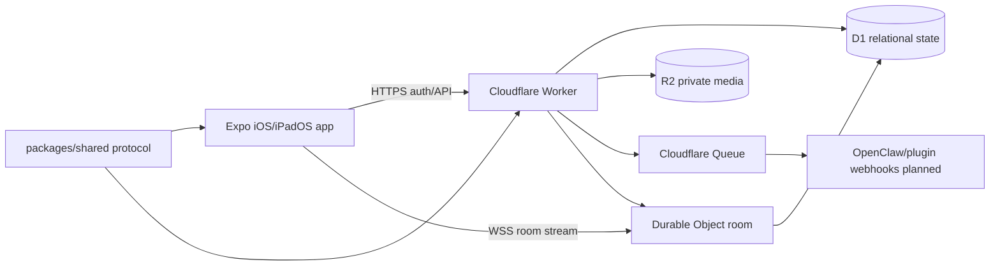

# Architecture

Karabiner is split into a native-feeling Expo app, a Cloudflare backend, and shared protocol types.

## Mobile app

- Expo Router provides navigation.
- Stable tabs are used first; native tabs are tracked as an alpha API to revisit.
- `expo-apple-authentication` provides Sign in with Apple.
- The current app shell presents Sign in with Apple and sample conversations; backend token exchange and `expo-secure-store` persistence are the next wiring step.
- `expo-glass-effect` is used behind runtime availability checks for iOS liquid glass surfaces.
- Message rendering is block-based so text, media, widgets, agent events, and future blocks can coexist.

## Backend

- Workers expose HTTP APIs for auth, users, conversations, messages, media intents, and future plugin entry points.
- Durable Objects coordinate realtime room WebSockets and persist/broadcast message envelopes.
- D1 stores users, sessions, conversations, memberships, messages, media metadata, plugins, slug-mojis, and moderation audit records.
- R2 stores private media objects.
- Queues handle async plugin dispatch, notifications, media processing, and future account deletion/data export jobs.

Current implemented Worker routes are `/health`, `/auth/apple`, `/auth/refresh`, `/auth/logout`, `/me`, `/conversations`, `POST /conversations/:id/messages`, `/media/upload-intents`, and `/rooms/:id/websocket`. Plugin dispatch currently queues/audits message-created events; manifest registry, plugin callbacks, and revocation endpoints are planned on top of the shared plugin protocol.

## Shared protocol

`packages/shared` defines the contract for:

- message blocks;
- widgets and actions;
- slash-command invocations;
- slug-mojis;
- conversations and memberships;
- realtime WebSocket envelopes;
- plugin manifests and dispatch events.

Both app and backend should import these types rather than duplicating protocol shapes.
